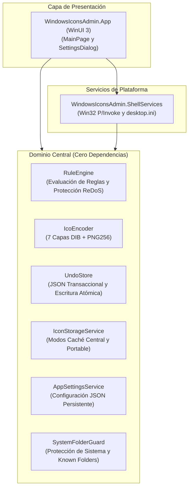

<p align="center">
  
</p>

# WindowsIconsAdmin

[English](README.md) | [Español](README.es.md)

[](https://dotnet.microsoft.com/)
[](https://learn.microsoft.com/dotnet/csharp/)
[](https://www.microsoft.com/windows)
[](tests/WindowsIconsAdmin.Core.Tests)
[](docs/adr/0001-winui3-dotnet-architecture.md)
[](LICENSE)

Utilidad de administración masiva y automatizada de iconos de carpetas para Windows 10 y 11, desarrollada en C# 13 y .NET 9 bajo estrictos estándares de ingeniería de software Cleanroom TDD.

---

## Descripción General

La personalización de iconos de carpetas en Windows tradicionalmente ha estado limitada a cuadros de propiedades manuales (carpeta por carpeta) o aplicaciones legadas obsoletas. WindowsIconsAdmin moderniza este flujo de trabajo mediante:

- **Motor de Reglas Automatizado**: Coincidencia basada en reglas (`Contains`, `StartsWith`, `EndsWith`, `Regex`) con priorización y protección contra ReDoS.
- **Codificación ICO Pura en Memoria**: Generación de binarios `.ico` con 7 resoluciones estándar (16px a 256px) a partir de cualquier PNG, con verificación de integridad a nivel de chunks.
- **Caché Central y Modalidad Dual de Almacenamiento**: Aplica Caché Central (`%LOCALAPPDATA%\WindowsIconsAdmin\Icons\`) de forma predeterminada para conservar las carpetas 100% limpias sin archivos de icono adicionales. El modo portable incrustado (`.folder_icon.ico`) se mantiene como opción avanzada opcional para unidades USB extraíbles.
- **Configuración Persistente y Diálogo de Ajustes**: Sistema de configuración seguro entre subprocesos mediante `AppSettingsService` (`settings.json`) acompañado de un diálogo modal `SettingsDialog` accesible desde la barra superior de herramientas, con integración automatizada de `.gitignore` global para `desktop.ini`.
- **Historial Transaccional Determinista**: Registro de instantáneas por lotes con persistencia atómica y autorrecuperación ante corrupción.
- **Invalidación del Shell sin Interrupciones**: Refresco en tiempo real mediante notificaciones Win32 de doble etapa con `SHChangeNotify` sin reiniciar `explorer.exe`.

---

## Arquitectura Limpia

La solución aplica una estricta separación de responsabilidades, desacoplando los algoritmos de dominio puros de las APIs del Shell de Windows y de la interfaz de usuario.



### Responsabilidades por Módulo

- **`WindowsIconsAdmin.Core`**: Biblioteca de clases independiente del sistema operativo con lógica pura:
  - `Rules`: Evaluación de nombres de carpetas según reglas declarativas (`FolderRule`, `RuleEngine`).
  - `Imaging`: Conversión en memoria de PNG a ICO multirresolución (`IcoEncoder`).
  - `History`: Registro transaccional seguro para subprocesos con reversión atómica (`UndoStore`).
  - `Storage`: Motor de almacenamiento que gestiona la Caché Central (`%LOCALAPPDATA%`) y el Modo Portable opcional (`IconStorageService`, `IconStorageMode`).
  - `Settings`: Almacén de configuración persistente hilo-seguro (`AppSettings`, `AppSettingsService`).
  - `Safety`: Protección de carpetas del sistema, barreras contra path traversal y bloqueo de extensiones restringidas (`SystemFolderGuard`).
- **`WindowsIconsAdmin.ShellServices`**: Encapsula atributos de archivos Win32, generación de `desktop.ini` y refresco de caché del explorador.
- **`WindowsIconsAdmin.App`**: Aplicación moderna con diseño Fluent para Windows 11 (WinUI 3 / Windows App SDK) con soporte de arrastrar y soltar multicarpetas, monitor de progreso por lotes, diálogo de reglas y un completo `SettingsDialog`.

---

## Metodología Cleanroom TDD

WindowsIconsAdmin.Core se construyó aplicando principios rigurosos de **Ingeniería de Software Cleanroom**:

1. **Contrato de Interfaz Congelado**: Las firmas de API, condiciones de borde y criterios de aceptación se definieron de forma previa en [core-services.contract.md](docs/contracts/core-services.contract.md) y [safety-and-integrity.contract.md](docs/contracts/safety-and-integrity.contract.md) antes de implementar código.
2. **Implementación y Pruebas Aisladas**: Las suites de pruebas unitarias se escribieron contra el contrato sin depender de los detalles internos de implementación.
3. **Verificación Exhaustiva**: Más de 450 pruebas unitarias verifican límites de error, seguridad entre subprocesos, tiempos límite ante retroceso catastrófico en expresiones regulares, formato binario ICO, salvaguardas de directorios del sistema y durabilidad de la configuración persistente.

```
Pruebas totales: 450+
Superadas:       100%
Fallidas:          0
Omitidas:          0
```

---

## Aprendizajes Clave y Particularidades del Shell de Windows

Durante la investigación e ingeniería del proyecto se documentaron múltiples detalles críticos del sistema operativo Windows:

- **La Compuerta de Atributos de Directorio Win32**: El Explorador de Windows ignora `desktop.ini` salvo que el directorio tenga activo el atributo `FILE_ATTRIBUTE_READONLY` (`0x0001`) o `FILE_ATTRIBUTE_SYSTEM` (`0x0004`). En carpetas de Windows, `ReadOnly` actúa exclusivamente como indicador del Shell y no bloquea permisos de escritura.
- **Caché Central vs. Carpetas Limpias**: Escribir archivos `.folder_icon.ico` sueltos dentro de las carpetas personalizadas contamina los repositorios Git y las sincronizaciones en la nube. WindowsIconsAdmin establece `IconStorageMode.CentralCache` como el modo obligatorio por defecto, almacenando los `.ico` con hash SHA256 en `%LOCALAPPDATA%\WindowsIconsAdmin\Icons\`. El modo portable se mantiene desactivado tras una preferencia explícita (`EnablePortableMode: false`).
- **Refresco No Destructivo del Shell**: Forzar la finalización de `explorer.exe` rompe el estado de la barra de tareas. Obtenemos un refresco instantáneo combinando `SHCNE_UPDATEITEM` (ruta específica) con `SHCNE_ASSOCCHANGED` (vaciado global de caché de iconos).
- **Truncamiento Silencioso de PNG en GDI+**: La clase .NET `Bitmap(stream)` decodifica streams PNG truncados sin arrojar error aun cuando falta el pie `IEND`. Implementamos validación binaria de chunks antes del decodificador para prevenir iconos corruptos.
- **Menús Contextuales en Windows 11**: El menú moderno de primer nivel requiere una DLL COM nativa en C++ que implemente `IExplorerCommand` con identidad de paquete. Los verbos de registro tradicionales (`HKCU\Software\Classes\Directory\shell`) permiten una integración inmediata sin privilegios en "Mostrar más opciones".
- **Refuerzo de Seguridad (Mark-of-the-Web)**: El Explorador descarta iconos personalizados en carpetas marcadas con identificadores de Zona 3 (Internet) de NTFS para prevenir fugas de credenciales y ataques UNC.

Para consultar el análisis técnico detallado:
- [Particularidades de Ingeniería del Shell de Windows e Iconos](docs/learning/windows-shell-and-icon-quirks.md)
- [ADR 0001: Selección Arquitectónica de .NET 9 WinUI 3 y Cleanroom TDD](docs/adr/0001-winui3-dotnet-architecture.md)

---

## Primeros Pasos

### Requisitos Previos

- [Windows 10 (Compilación 19041+) o Windows 11](https://www.microsoft.com/windows)
- [.NET 9.0 SDK](https://dotnet.microsoft.com/download/dotnet/9.0)

### Compilación y Ejecución de Pruebas

Clone el repositorio y ejecute la suite de pruebas:

```powershell
# Clonar repositorio
git clone https://github.com/AnaCataVC/windows-icons-admin.git
cd windows-icons-admin

# Restaurar y compilar solución
dotnet build

# Ejecutar suite de pruebas Cleanroom
dotnet test
```

---

## Aprendizajes Clave

El diseño e implementación de WindowsIconsAdmin bajo rigurosos estándares de Cleanroom TDD consolidó lecciones fundamentales de ingeniería de sistemas Windows:

- **Señal de Atributo Win32 en Carpetas:** Windows Explorer ignora por completo `desktop.ini` a menos que el directorio tenga el atributo `FILE_ATTRIBUTE_READONLY` o `FILE_ATTRIBUTE_SYSTEM`. En directorios, este flag no bloquea la escritura; actúa exclusivamente como señal interna del Shell para evaluar personalizaciones.
- **Política de Caché Central y Limpieza del Espacio de Trabajo:** Escribir archivos `.folder_icon.ico` incrustados contamina la estructura de directorios y los repositorios Git. Establecer `IconStorageMode.CentralCache` como modalidad obligatoria por defecto en `%LOCALAPPDATA%` mantiene limpias las carpetas mientras conserva la resolución instantánea. El modo portable queda reservado como función avanzada opcional para medios extraíbles.
- **Configuración Atómica Persistente (`AppSettingsService`):** Las preferencias de la aplicación se mantienen en `%LOCALAPPDATA%\WindowsIconsAdmin\settings.json` mediante compuertas de sincronización hilo-seguras, reemplazo atómico de archivos (`.tmp` hacia destino con `File.Replace`) y respaldo automático de emergencia ante archivos corruptos (`.bak`).
- **Refresco No Destructivo del Shell:** Matar `explorer.exe` rompe la barra de tareas y aplicaciones en segundo plano. La actualización en vivo se logra mediante notificaciones Win32 duales: `SHCNE_UPDATEITEM` para rutas específicas combinado con `SHCNE_ASSOCCHANGED` para invalidar la caché de iconos en memoria.
- **Protección ante Truncamiento Silencioso en GDI+:** Los decodificadores estándar de .NET procesan streams PNG truncados sin footer `IEND`. Se desarrolló un analizador de integridad a nivel de chunks para evitar la generación de binarios `.ico` corruptos.
- **Desacoplamiento Arquitectónico Cleanroom:** `WindowsIconsAdmin.Core` se diseñó con cero dependencias de UI o APIs de plataforma, imponiendo contratos congelados y pruebas unitarias aisladas que validan límites ReDoS, transacciones de deshacer hilo-seguras, codificación binaria multirresolución y protecciones de carpetas del sistema contra traversal e inyecciones.

---

## Estructura del Repositorio

```
windows-icons-admin/
├── docs/
│   ├── adr/
│   │   ├── 0001-winui3-dotnet-architecture.md
│   │   └── 0002-system-folder-guard-and-ini-hardening.md
│   ├── contracts/
│   │   ├── core-services.contract.md
│   │   └── safety-and-integrity.contract.md
│   ├── external-references/
│   │   ├── folder-icon-tool-stack-alternatives.md
│   │   └── windows-folder-icons-automation.md
│   └── learning/
│       ├── windows-shell-and-icon-quirks.md
│       └── windows-shell-safety-and-integrity.md
├── src/
│   ├── WindowsIconsAdmin.App/
│   │   ├── Dialogs/       # SettingsDialog, RulesDialog, SystemIconsDialog
│   │   ├── Services/      # WinUI 3 dialog and picker helpers
│   │   ├── ViewModels/    # MVVM models and folder item tracking
│   │   └── Views/         # WinUI 3 pages and window controls
│   └── WindowsIconsAdmin.Core/
│       ├── History/       # Transactional undo and rolling snapshot store
│       ├── Imaging/       # Chunk-verified multi-resolution ICO encoder
│       ├── Layout/        # Window sizing and DPI computation
│       ├── Rules/         # ReDoS-safe rule matching engine
│       ├── Safety/        # System folder protection & traversal guard
│       ├── Settings/      # Persistent AppSettings & thread-safe AppSettingsService
│       ├── Shell/         # Hardened INI helpers and shell services
│       └── Storage/       # Central cache and portable icon storage service
├── tests/
│   └── WindowsIconsAdmin.Core.Tests/
│       ├── Helpers/       # Test PNG and ICO binary validators
│       ├── History/       # UndoStore concurrency and durability tests
│       ├── Imaging/       # IcoEncoder pixel and chunk boundary tests
│       ├── Rules/         # RuleEngine regex and condition tests
│       ├── Safety/        # SystemFolderGuard and path traversal tests
│       ├── Settings/      # AppSettingsService persistence and corruption recovery tests
│       ├── Shell/         # Hardened IniHelper and ShellIconService tests
│       └── Storage/       # IconStorageService and path validation tests
├── README.md
├── README.es.md
└── WindowsIconsAdmin.sln
```

---

## Licencia

Este proyecto se distribuye bajo la licencia [MIT](LICENSE).
