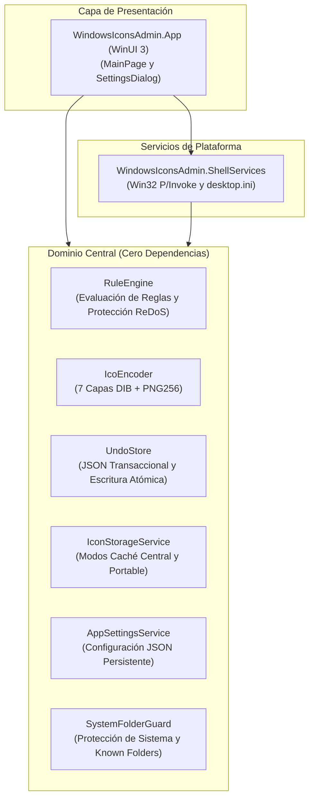

<p align="center">
  
</p>

# WindowsIconsAdmin

[English](README.md) | [Español](README.es.md)

[](https://dotnet.microsoft.com/)
[](https://learn.microsoft.com/dotnet/csharp/)
[](https://learn.microsoft.com/windows/apps/winui/winui3/)
[](https://www.microsoft.com/windows)
[](tests/WindowsIconsAdmin.Core.Tests)
[](docs/adr/0001-winui3-dotnet-architecture.md)
[](LICENSE)

Utilidad de administración masiva y automatizada de iconos de carpetas para Windows 10 y 11, desarrollada en C# 13 y .NET 9 bajo estrictos estándares de ingeniería de software Cleanroom TDD.

---

## Resumen

La personalización de iconos de carpetas en Windows tradicionalmente ha estado dividida entre cuadros de propiedades manuales (carpeta por carpeta) o aplicaciones legadas obsoletas. WindowsIconsAdmin moderniza este flujo de trabajo en una aplicación de escritorio automatizada y no destructiva, respetando los espacios de trabajo de desarrolladores, árboles de sincronización en la nube y la integridad del Shell de Windows.

### Características Principales

- **Motor de Reglas Automatizado**: Coincidencia de reglas de alto rendimiento (`Contains`, `StartsWith`, `EndsWith`, `Regex`) con priorización y protección contra retroceso catastrófico ReDoS.
- **Codificación ICO Pura en Memoria**: Generación de binarios `.ico` conformes de 7 resoluciones estándar (16px a 256px) a partir de imágenes PNG arbitrarias con verificación de integridad a nivel de chunks.
- **Caché Central y Modalidad Dual de Almacenamiento**: Aplica Caché Central (`%LOCALAPPDATA%\WindowsIconsAdmin\Icons\`) de forma predeterminada para conservar las carpetas 100% limpias sin archivos de icono adicionales. El modo portable incrustado (`.folder_icon.ico`) se mantiene como opción avanzada opcional para unidades USB extraíbles.
- **Panel de Navegación e Iconos de Unidades de Windows 11**: Personalización de iconos para elementos de la barra lateral del Explorador de Windows 11 y volúmenes de disco con salvaguardas de restauración segura para OneDrive.
- **Configuración Persistente y Diálogo de Ajustes**: Sistema de configuración seguro entre subprocesos mediante `AppSettingsService` (`settings.json`) acompañado de un diálogo modal `SettingsDialog` accesible desde la barra superior de herramientas, con integración automatizada de `.gitignore` global para `desktop.ini`.
- **Historial Transaccional Determinista**: Registro de instantáneas por lotes con persistencia atómica y autorrecuperación ante corrupción.
- **Invalidación del Shell sin Interrupciones**: Refresco en tiempo real mediante notificaciones Win32 de doble etapa con `SHChangeNotify` sin reiniciar `explorer.exe`.

---

## Arquitectura Limpia

La solución aplica una estricta separación de responsabilidades, desacoplando los algoritmos de dominio puros de las APIs del Shell de Windows y de la interfaz de usuario.



### Responsabilidades por Módulo

- **`WindowsIconsAdmin.Core`**: Biblioteca de clases independiente del sistema operativo con lógica pura:
  - `Rules`: Evaluación de nombres de carpetas según reglas declarativas (`FolderRule`, `RuleEngine`).
  - `Imaging`: Conversión en memoria de PNG a ICO multirresolución (`IcoEncoder`).
  - `History`: Registro transaccional seguro para subprocesos con reversión atómica (`UndoStore`).
  - `Storage`: Motor de almacenamiento que gestiona la Caché Central (`%LOCALAPPDATA%`) y el Modo Portable opcional (`IconStorageService`, `IconStorageMode`).
  - `Settings`: Almacén de configuración persistente hilo-seguro (`AppSettings`, `AppSettingsService`).
  - `Safety`: Protección de carpetas del sistema, barreras contra path traversal y bloqueo de extensiones restringidas (`SystemFolderGuard`).
- **`WindowsIconsAdmin.ShellServices`**: Encapsula atributos de archivos Win32, generación de `desktop.ini` y refresco de caché del explorador.
- **`WindowsIconsAdmin.App`**: Aplicación moderna con diseño Fluent para Windows 11 (WinUI 3 / Windows App SDK) con soporte de arrastrar y soltar multicarpetas, monitor de progreso por lotes, diálogo de reglas y un completo `SettingsDialog`.
- **`installer/`**: Script oficial de empaquetado de Inno Setup 6 que genera el instalador oficial firmado único (`WindowsIconsAdmin_Setup.exe`).

---

## Stack Tecnológico

- **Runtime y Lenguaje**: .NET 9.0 (`net9.0-windows10.0.26100.0`), C# 13.0
- **Framework de UI y Presentación**: WinUI 3 (Windows App SDK 1.6), Windows 11 Fluent Design y material Mica
- **Interoperabilidad con la Plataforma**: Win32 Shell API (`shell32.dll`, `SHChangeNotify`, `GetFileAttributesW`, `SetFileAttributesW`)
- **Empaquetado y Distribución**: Inno Setup 6 (compresión sólida lzma2/ultra64)
- **Framework de Pruebas Unitarias**: xUnit 2.9, FluentAssertions 8.0

---

## Compilación y Ejecución

### Requisitos Previos

- [Windows 10 (Compilación 19041+) o Windows 11](https://www.microsoft.com/windows)
- [.NET 9.0 SDK](https://dotnet.microsoft.com/download/dotnet/9.0)

### Configuración Local y Compilación

Clone el repositorio y compile la solución completa:

```powershell
# Clonar repositorio
git clone https://github.com/AnaCataVC/windows-icons-admin.git
cd windows-icons-admin

# Restaurar y compilar solución
dotnet build WindowsIconsAdmin.sln -c Release
```

---

## Pruebas Automatizadas

WindowsIconsAdmin.Core se construyó aplicando principios rigurosos de **Ingeniería de Software Cleanroom**:

1. **Contrato de Interfaz Congelado**: Las firmas de API, condiciones de borde y criterios de aceptación se definieron de forma previa en [core-services.contract.md](docs/contracts/core-services.contract.md), [safety-and-integrity.contract.md](docs/contracts/safety-and-integrity.contract.md) y [window-sizing.contract.md](docs/contracts/window-sizing.contract.md) antes de implementar código.
2. **Implementación y Pruebas Aisladas**: Las suites de pruebas unitarias se escribieron contra el contrato sin depender de los detalles internos de implementación.
3. **Verificación Exhaustiva**: 459 pruebas unitarias verifican límites de error, seguridad entre subprocesos, tiempos límite ante retroceso catastrófico en expresiones regulares, formato binario ICO, salvaguardas de directorios del sistema y durabilidad de la configuración persistente.

```powershell
# Ejecutar suite de pruebas Cleanroom completa
dotnet test tests/WindowsIconsAdmin.Core.Tests/WindowsIconsAdmin.Core.Tests.csproj
```

```text
Pruebas totales: 459
Superadas:       459 (100%)
Fallidas:          0
Omitidas:          0
Duración:        ~2.0s
```

---

## Decisiones de Arquitectura y Aprendizajes

El diseño e ingeniería de WindowsIconsAdmin bajo rigurosos estándares de Cleanroom TDD consolidó lecciones fundamentales de sistemas Windows:

1. **Compuerta de Atributos Win32 en Carpetas:** Windows Explorer ignora por completo `desktop.ini` a menos que el directorio tenga activo el atributo `FILE_ATTRIBUTE_READONLY` (`0x0001`) o `FILE_ATTRIBUTE_SYSTEM` (`0x0004`). En carpetas, este flag no bloquea la escritura; actúa exclusivamente como señal interna del Shell para evaluar personalizaciones.
2. **Política de Caché Central y Limpieza del Espacio de Trabajo:** Escribir archivos `.folder_icon.ico` incrustados contamina la estructura de directorios y los repositorios Git. Establecer `IconStorageMode.CentralCache` como modalidad obligatoria por defecto en `%LOCALAPPDATA%` mantiene limpias las carpetas mientras conserva la resolución instantánea. El modo portable queda reservado como función avanzada opcional para medios extraíbles.
3. **Configuración Atómica Persistente (`AppSettingsService`):** Las preferencias de la aplicación se mantienen en `%LOCALAPPDATA%\WindowsIconsAdmin\settings.json` mediante compuertas de sincronización hilo-seguras, reemplazo atómico de archivos (`.tmp` hacia destino con `File.Replace`) y respaldo automático de emergencia ante archivos corruptos (`.bak`).
4. **Refresco No Destructivo del Shell:** Finalizar `explorer.exe` rompe la barra de tareas y aplicaciones en segundo plano. La actualización en vivo se logra mediante notificaciones Win32 duales: `SHCNE_UPDATEITEM` para rutas específicas combinado con `SHCNE_ASSOCCHANGED` para invalidar la caché de iconos en memoria.
5. **Protección ante Truncamiento Silencioso en GDI+:** Los decodificadores estándar de .NET procesan streams PNG truncados sin arrojar error aun cuando falta el pie `IEND`. Se desarrolló un analizador de integridad a nivel de chunks para evitar la generación de binarios `.ico` corruptos.
6. **Menús Contextuales en Windows 11:** El menú moderno de primer nivel requiere una DLL COM nativa en C++ que implemente `IExplorerCommand` con identidad de paquete. Los verbos de registro tradicionales (`HKCU\Software\Classes\Directory\shell`) permiten una integración inmediata sin privilegios en "Mostrar más opciones".
7. **Refuerzo de Seguridad (Mark-of-the-Web):** El Explorador descarta iconos personalizados en carpetas marcadas con identificadores de Zona 3 (Internet) de NTFS para prevenir fugas de credenciales y ataques UNC.
8. **Desacoplamiento Arquitectónico Cleanroom:** `WindowsIconsAdmin.Core` se diseñó con cero dependencias de UI o APIs de plataforma, imponiendo contratos congelados y pruebas unitarias aisladas que validan límites ReDoS, transacciones de deshacer hilo-seguras, codificación binaria multirresolución y protecciones de carpetas del sistema contra traversal e inyecciones.

Para consultar el análisis técnico detallado:
- [Particularidades de Ingeniería del Shell de Windows e Iconos](docs/learning/windows-shell-and-icon-quirks.md)
- [ADR 0001: Selección Arquitectónica de .NET 9 WinUI 3 y Cleanroom TDD](docs/adr/0001-winui3-dotnet-architecture.md)
- [ADR 0002: Refuerzo de Seguridad de Carpetas del Sistema e INI](docs/adr/0002-system-folder-guard-and-ini-hardening.md)
- [ADR 0003: Selector Multicarpetas y Motor de Reglas Persistente](docs/adr/0003-multi-folder-picker-and-persistent-rules-engine.md)

---

## Estructura del Repositorio

```
windows-icons-admin/
├── docs/
│   ├── adr/
│   │   ├── 0001-winui3-dotnet-architecture.md
│   │   ├── 0002-system-folder-guard-and-ini-hardening.md
│   │   └── 0003-multi-folder-picker-and-persistent-rules-engine.md
│   ├── audits/
│   │   └── initial-core-audit.md
│   ├── contracts/
│   │   ├── core-services.contract.md
│   │   ├── safety-and-integrity.contract.md
│   │   └── window-sizing.contract.md
│   ├── external-references/
│   │   ├── folder-icon-tool-stack-alternatives.md
│   │   ├── system-icons-stress-test.md
│   │   ├── windows-folder-icons-automation.md
│   │   ├── windows-system-and-default-icons.md
│   │   └── windows11-navigation-pane-and-drive-icons.md
│   └── learning/
│       ├── windows-shell-and-icon-quirks.md
│       └── windows-shell-safety-and-integrity.md
├── installer/
│   └── setup.iss          # Script de empaquetado Inno Setup
├── src/
│   ├── WindowsIconsAdmin.App/
│   │   ├── Dialogs/       # SettingsDialog, RulesDialog, SystemIconsDialog
│   │   ├── Services/      # Diálogos y selectores de WinUI 3
│   │   ├── ViewModels/    # Modelos MVVM y seguimiento de carpetas
│   │   └── Views/         # Páginas y controles de ventana de WinUI 3
│   └── WindowsIconsAdmin.Core/
│       ├── History/       # Historial de transacciones de deshacer
│       ├── Imaging/       # Codificador ICO multirresolución con chunks verificados
│       ├── Layout/        # Dimensionamiento de ventana y cálculo de DPI
│       ├── Rules/         # Motor de reglas seguro contra ReDoS
│       ├── Safety/        # Protección de carpetas del sistema y barreras de traversal
│       ├── Settings/      # AppSettings persistente y servicio hilo-seguro
│       ├── Shell/         # Helpers INI reforzados y servicios del Shell
│       └── Storage/       # Servicio de almacenamiento de iconos central y portable
├── tests/
│   └── WindowsIconsAdmin.Core.Tests/
│       ├── Helpers/       # Validadores binarios de prueba para PNG e ICO
│       ├── History/       # Pruebas de concurrencia y durabilidad de UndoStore
│       ├── Imaging/       # Pruebas de píxeles y límites de chunk en IcoEncoder
│       ├── Rules/         # Pruebas de condiciones y expresiones regulares de RuleEngine
│       ├── Safety/        # Pruebas de SystemFolderGuard y path traversal
│       ├── Settings/      # Pruebas de persistencia y autorrecuperación de AppSettingsService
│       ├── Shell/         # Pruebas de IniHelper reforzado y ShellIconService
│       └── Storage/       # Pruebas de IconStorageService y validación de rutas
├── README.md
├── README.es.md
└── WindowsIconsAdmin.sln
```

---

## Licencia

Este proyecto se distribuye bajo la licencia [MIT](LICENSE).
