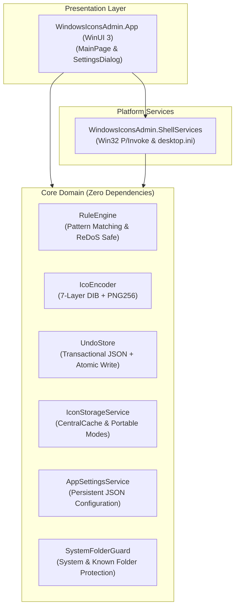

<p align="center">
  
</p>

# WindowsIconsAdmin

[English](README.md) | [Español](README.es.md)

[](https://dotnet.microsoft.com/)
[](https://learn.microsoft.com/dotnet/csharp/)
[](https://www.microsoft.com/windows)
[](tests/WindowsIconsAdmin.Core.Tests)
[](docs/adr/0001-winui3-dotnet-architecture.md)
[](LICENSE)

High-performance, automated bulk folder icon administration utility for Windows 10 and 11, engineered in C# 13 and .NET 9 with strict Cleanroom TDD standards.

---

## Overview

Customizing folder icons in Windows has historically been divided between manual, single-folder property sheets or abandoned legacy utilities. WindowsIconsAdmin modernizes this workflow with:

- **Automated Rule Engine**: Rule-based matching (`Contains`, `StartsWith`, `EndsWith`, `Regex`) with priority ordering and ReDoS protection.
- **Pure-Stream ICO Encoding**: Generates compliant 7-resolution `.ico` binaries (16px to 256px) from arbitrary PNGs with chunk-level integrity verification.
- **Central Cache & Dual Storage Modality**: Enforces Central Cache (`%LOCALAPPDATA%\WindowsIconsAdmin\Icons\`) by default to keep folders 100% clean without loose icon assets. Portable embedded mode (`.folder_icon.ico`) is supported as an opt-in advanced setting for removable USB drives.
- **Persistent Configuration & Settings Dialog**: Thread-safe configuration system via `AppSettingsService` (`settings.json`) paired with a dedicated modal `SettingsDialog` accessible from the top toolbar, featuring automated global `.gitignore` integration for `desktop.ini`.
- **Deterministic Transactional Undo**: Multi-batch snapshot history with atomic file persistence and automatic corruption recovery.
- **Zero-Disruption Shell Invalidation**: Real-time icon refresh via dual-stage `SHChangeNotify` Win32 notifications without restarting `explorer.exe`.

---

## Clean Architecture

The solution enforces strict separation of concerns, decoupling pure domain algorithms from Windows Shell APIs and presentation layers.



### Module Responsibilities

- **`WindowsIconsAdmin.Core`**: Target-independent class library containing pure logic:
  - `Rules`: High-throughput folder name rule evaluation (`FolderRule`, `RuleEngine`).
  - `Imaging`: In-memory PNG-to-ICO multi-resolution conversion (`IcoEncoder`).
  - `History`: Thread-safe, atomic undo/redo transaction log (`UndoStore`).
  - `Storage`: Storage engine managing Central Cache (`%LOCALAPPDATA%`) and optional Portable Mode (`IconStorageService`, `IconStorageMode`).
  - `Settings`: Thread-safe persistent configuration store (`AppSettings`, `AppSettingsService`).
  - `Safety`: System folder protection, path traversal defenses, and restricted file extension guards (`SystemFolderGuard`).
- **`WindowsIconsAdmin.ShellServices`**: Encapsulates Win32 filesystem attributes, `desktop.ini` generation, and shell cache refresh.
- **`WindowsIconsAdmin.App`**: Modern Windows 11 Fluent UI application (WinUI 3 / Windows App SDK) featuring multi-folder drag-and-drop, batch progress monitoring, rule management, and a comprehensive `SettingsDialog`.

---

## Cleanroom TDD Methodology

WindowsIconsAdmin.Core was engineered using a rigorous **Cleanroom Software Engineering** approach:

1. **Frozen Interface Contract**: Complete API specifications, boundary conditions, and acceptance criteria were formalized in [core-services.contract.md](docs/contracts/core-services.contract.md) and [safety-and-integrity.contract.md](docs/contracts/safety-and-integrity.contract.md) before writing code.
2. **Air-Gapped Test & Implementation**: Unit test suites were developed against the specification independently from the core implementation.
3. **Comprehensive Verification**: Over 450 unit tests validate error boundaries, thread safety, regex catastrophic timeouts, binary ICO structures, system folder protections, and persistent configuration durability.

```
Total Tests:     450+
Passed:          100%
Failed:            0
Skipped:           0
```

---

## Key Learnings & Windows Shell Quirks

During development and research, several subtle Windows OS behaviors and edge cases were identified and documented:

- **The Win32 Folder Attribute Gate**: Windows Explorer bypasses `desktop.ini` unless the directory is flagged with `FILE_ATTRIBUTE_READONLY` (`0x0001`) or `FILE_ATTRIBUTE_SYSTEM` (`0x0004`). On Windows folders, the `ReadOnly` attribute acts purely as a shell signal and does not lock files.
- **Central Cache vs. Clean Folders**: Generating loose `.folder_icon.ico` files in customized folders contaminates Git repositories and cloud storage sync trees. WindowsIconsAdmin establishes `IconStorageMode.CentralCache` as the mandatory default, caching SHA256-hashed `.ico` files in `%LOCALAPPDATA%\WindowsIconsAdmin\Icons\`. Portable embedded storage is gated behind an explicit preference (`EnablePortableMode: false`).
- **Non-Destructive Shell Refresh**: Forcing `explorer.exe` to terminate destroys taskbar state. We achieve instant live refreshes by combining `SHCNE_UPDATEITEM` (per-path) with `SHCNE_ASSOCCHANGED` (global icon cache flush).
- **GDI+ Silent PNG Truncation**: Standard .NET `Bitmap(stream)` silently decodes truncated PNG streams with missing `IEND` footers. We implemented manual PNG chunk validation to prevent producing corrupt `.ico` binaries.
- **Windows 11 Context Menu Separation**: Modern top-level context menus require an in-process native C++ COM DLL implementing `IExplorerCommand` packaged with identity. Classic registry verbs (`HKCU\Software\Classes\Directory\shell`) provide instant, unprivileged integration under "Show more options".
- **Security Hardening (Mark-of-the-Web)**: Explorer ignores custom icons on directories marked with NTFS Zone 3 identifiers to mitigate remote UNC attacks.

For deep technical analysis, read:
- [Windows Shell & Icon Engineering Quirks](docs/learning/windows-shell-and-icon-quirks.md)
- [ADR 0001: .NET 9 WinUI 3 Architecture & Cleanroom TDD](docs/adr/0001-winui3-dotnet-architecture.md)

---

## Getting Started

### Prerequisites

- [Windows 10 (Build 19041+) or Windows 11](https://www.microsoft.com/windows)
- [.NET 9.0 SDK](https://dotnet.microsoft.com/download/dotnet/9.0)

### Build & Run Tests

Clone the repository and run the test suite:

```powershell
# Clone repository
git clone https://github.com/AnaCataVC/windows-icons-admin.git
cd windows-icons-admin

# Restore and build solution
dotnet build

# Execute cleanroom test suite
dotnet test
```

---

## Key Learnings

Building and architecting WindowsIconsAdmin under Cleanroom TDD standards yielded fundamental Windows systems engineering takeaways:

- **Win32 Folder Attribute Shell Gate:** Windows Explorer ignores `desktop.ini` unless the directory is flagged with `FILE_ATTRIBUTE_READONLY` or `FILE_ATTRIBUTE_SYSTEM`. On folders, this attribute does not lock write permissions and acts solely as an internal shell signal to parse customizations.
- **Central Cache Policy & Workspace Cleanliness:** Writing embedded `.folder_icon.ico` files pollutes directory trees and Git repositories. Enforcing `IconStorageMode.CentralCache` as the default storage mechanism in `%LOCALAPPDATA%` leaves folders clean while retaining instant icon resolution. Portable mode is preserved as an optional, opt-in feature for removable drives.
- **Persistent Atomic Configuration (`AppSettingsService`):** Configuration state is maintained in `%LOCALAPPDATA%\WindowsIconsAdmin\settings.json` using thread-safe synchronization gates, atomic file replacement (`.tmp` to target via `File.Replace`), and automatic corrupted-file backup (`.bak`).
- **Non-Destructive Shell Refresh:** Terminating `explorer.exe` disrupts taskbar state and running tray apps. Instant live updates are achieved via dual Win32 notifications: `SHCNE_UPDATEITEM` for path-specific updates paired with `SHCNE_ASSOCCHANGED` to invalidate the in-memory shell icon cache.
- **GDI+ Silent PNG Truncation Guard:** Standard .NET image decoders silently process truncated PNG streams lacking valid `IEND` footer chunks. A custom chunk-level PNG integrity parser was built to prevent generating malformed `.ico` binaries.
- **Cleanroom TDD Architectural Decoupling:** `WindowsIconsAdmin.Core` was engineered with zero dependencies on UI or platform APIs, enforcing frozen interface contracts and comprehensive air-gapped unit tests covering ReDoS timeouts, thread-safe undo transactions, multi-resolution binary encoding, and system folder protection safeguards.

---

## Repository Structure

```
windows-icons-admin/
├── docs/
│   ├── adr/
│   │   ├── 0001-winui3-dotnet-architecture.md
│   │   └── 0002-system-folder-guard-and-ini-hardening.md
│   ├── contracts/
│   │   ├── core-services.contract.md
│   │   └── safety-and-integrity.contract.md
│   ├── external-references/
│   │   ├── folder-icon-tool-stack-alternatives.md
│   │   └── windows-folder-icons-automation.md
│   └── learning/
│       ├── windows-shell-and-icon-quirks.md
│       └── windows-shell-safety-and-integrity.md
├── src/
│   ├── WindowsIconsAdmin.App/
│   │   ├── Dialogs/       # SettingsDialog, RulesDialog, SystemIconsDialog
│   │   ├── Services/      # WinUI 3 dialog and picker helpers
│   │   ├── ViewModels/    # MVVM models and folder item tracking
│   │   └── Views/         # WinUI 3 pages and window controls
│   └── WindowsIconsAdmin.Core/
│       ├── History/       # Transactional undo and rolling snapshot store
│       ├── Imaging/       # Chunk-verified multi-resolution ICO encoder
│       ├── Layout/        # Window sizing and DPI computation
│       ├── Rules/         # ReDoS-safe rule matching engine
│       ├── Safety/        # System folder protection & traversal guard
│       ├── Settings/      # Persistent AppSettings & thread-safe AppSettingsService
│       ├── Shell/         # Hardened INI helpers and shell services
│       └── Storage/       # Central cache and portable icon storage service
├── tests/
│   └── WindowsIconsAdmin.Core.Tests/
│       ├── Helpers/       # Test PNG and ICO binary validators
│       ├── History/       # UndoStore concurrency and durability tests
│       ├── Imaging/       # IcoEncoder pixel and chunk boundary tests
│       ├── Rules/         # RuleEngine regex and condition tests
│       ├── Safety/        # SystemFolderGuard and path traversal tests
│       ├── Settings/      # AppSettingsService persistence and corruption recovery tests
│       ├── Shell/         # Hardened IniHelper and ShellIconService tests
│       └── Storage/       # IconStorageService and path validation tests
├── README.md
├── README.es.md
└── WindowsIconsAdmin.sln
```

---

## License

This project is licensed under the [MIT License](LICENSE).
