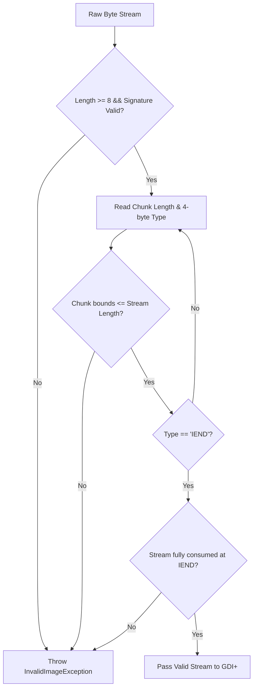

# Windows Shell & Icon Engineering Quirks

This document records the architectural learnings, Win32 filesystem subtleties, image codec edge cases, and Windows 11 shell integration constraints encountered while building **WindowsIconsAdmin**.

---

## 1. Win32 Attribute Protocol for `desktop.ini`

Windows Explorer customizes folders (assigning custom icons, localized display names, and folder types) via a legacy, high-performance attribute protocol dating back to Windows 95.

### 1.1 The Folder Discovery Gate
Windows Explorer does not scan for `desktop.ini` on every folder traversal. Doing so would cause catastrophic filesystem I/O degradation. Instead:
- Explorer queries the directory's Win32 attributes (`GetFileAttributesW`).
- Explorer reads and parses `desktop.ini` **if and only if** the parent directory has either the `FILE_ATTRIBUTE_READONLY` (`0x0001`) or `FILE_ATTRIBUTE_SYSTEM` (`0x0004`) flag set.
- If neither flag is set, Explorer bypasses `desktop.ini` entirely, rendering the folder with its default shell glyph.

> [!NOTE]
> On modern Windows (Windows 10 / Windows 11), setting `FILE_ATTRIBUTE_READONLY` on a directory does **not** make the folder write-protected or prevent creating, renaming, or deleting files within it. It serves strictly as a shell signaling flag instructing Explorer to parse customization metadata.

### 1.2 Attributes on `desktop.ini` Itself
The `desktop.ini` configuration file itself must also possess specific attributes:
- **Required File Flags:** `FILE_ATTRIBUTE_HIDDEN` (`0x0002`) | `FILE_ATTRIBUTE_SYSTEM` (`0x0004`).
- If `desktop.ini` is marked as normal or visible, Explorer may ignore its directives or expose the file to the user when viewing hidden files.

### 1.3 Teardown and Default Icon Restoration
Restoring a folder to default requires careful sequencing:
1. Clear the attributes on `desktop.ini` by resetting to `FILE_ATTRIBUTE_NORMAL` (`0x0080`). Attempting to delete a file flagged as `SYSTEM` or `READONLY` can fail with `WinError 5: Access is Denied` under standard user permissions.
2. Delete the `desktop.ini` file (or strip the `[.ShellClassInfo]` section if other shell properties must persist).
3. If no other customization applies, strip `FILE_ATTRIBUTE_READONLY` from the directory attributes.
4. Issue real-time shell invalidation notifications.

---

## 2. Real-Time Shell Refresh & Cache Invalidation

Windows Explorer maintains a multi-tier icon cache (`IconCache.db` and Explorer thumbnail databases). Updating `desktop.ini` does not automatically update open Explorer windows.

### 2.1 The Anti-Pattern: Restarting Explorer
Forcibly terminating `explorer.exe` (`taskkill /f /im explorer.exe`) discards unsaved taskbar states, disrupts open system tray icons, and ruins user workflow. Cleanroom shell utilities must use non-destructive Win32 notification APIs instead.

### 2.2 Dual-Stage Notification with `SHChangeNotify`
Effective instant cache invalidation requires two complementary notifications via `shell32.dll`:

```csharp
[DllImport("shell32.dll", CharSet = CharSet.Unicode, SetLastError = true)]
internal static extern void SHChangeNotify(
    uint wEventId, 
    uint uFlags, 
    nint dwItem1, 
    nint dwItem2);

public const uint SHCNE_UPDATEITEM   = 0x00002000;
public const uint SHCNE_ASSOCCHANGED = 0x08000000;
public const uint SHCNF_PATHW        = 0x00000005;
public const uint SHCNF_IDLIST       = 0x00000000;
```

1. **Targeted Item Invalidation (`SHCNE_UPDATEITEM` with `SHCNF_PATHW`):**
   Notifies the shell that a specific folder path's metadata has changed. Any Explorer window currently displaying this folder updates immediately.
2. **Global Association Invalidation (`SHCNE_ASSOCCHANGED` with `SHCNF_IDLIST`):**
   Flushes the shell's internal icon cache and triggers re-resolution of icon resources across all active views without requiring a system reboot or shell restart.

---

## 3. GDI+ Truncation Flaw & Robust ICO Stream Verification

Generating Windows `.ico` binaries from arbitrary PNG inputs exposes severe edge cases in .NET's `System.Drawing` (GDI+) image pipeline.

### 3.1 GDI+ Silent Truncation Behavior
The standard GDI+ decoder (`new Bitmap(stream)`) is extremely fault-tolerant—to a fault. When fed an incomplete PNG file where:
- The byte stream is truncated mid-chunk,
- The mandatory `IEND` footer chunk is missing, or
- Chunk length headers do not balance with total stream length,

GDI+ does **not** consistently throw an exception. Instead, it decodes whatever partial scanlines exist, filling remaining regions with black or transparent pixels. In automated systems, this silently writes corrupt `.ico` files to disk.

### 3.2 Chunk-Level Binary Validation (`ValidatePngChunks`)
To guarantee contract conformance, `WindowsIconsAdmin.Core.Imaging.IcoEncoder` implements pre-decode chunk verification before handing bytes to GDI+:



The chunk validator enforces:
1. The 8-byte PNG magic header (`89 50 4E 47 0D 0A 1A 0A`).
2. Big-endian chunk length calculations with strict boundary checks.
3. Verification of `IHDR` presence and structure.
4. Strict termination at `IEND`, verifying that no truncated byte garbage lingers at EOF.

### 3.3 Multi-Resolution `.ico` Packaging Rules
Windows icons require specific container layouts:
- **Container Structure (`ICONDIR`):** Reserved (`0`), Resource Type (`1` for icon), Image Count (`7`).
- **Standard DIB Layers (16, 24, 32, 48, 64, 128 px):**
  - Uncompressed 32-bit `BITMAPINFOHEADER` (biHeight = 2 * height).
  - BGRA pixel array in bottom-up row order.
  - 1-bit monochrome AND mask (rows padded to 4-byte boundaries).
- **High-DPI Layer (256 px):**
  - Must be formatted as raw compressed PNG data within the `.ico` file to avoid generating multi-megabyte icon files.
  - In `ICONDIRENTRY`, width and height are recorded as `0` (denoting 256 px).

---

## 4. Windows 11 Explorer Context Menu Architecture & COM Constraints

Integrating folder customization into the Windows Explorer right-click menu presents stark architectural differences between legacy and modern Windows versions.

### 4.1 Modern vs Classic Context Menus
Windows 11 splits context menus into two layers:
1. **Modern Top-Level Menu:** Fast, touch-friendly, restricted.
2. **"Show More Options" Submenu:** Legacy Windows 10 style registry shell extensions.

```
+-------------------------------------------------------+
| Windows 11 Explorer Context Menu                      |
|                                                       |
|  [Cut]  [Copy]  [Rename]  [Delete]                    |
|  ---------------------------------                    |
|  Open in Terminal                                     |
|  * Change Folder Icon (Requires IExplorerCommand COM) |
|  ---------------------------------                    |
|  > Show more options  ----------------------------+   |
+---------------------------------------------------|---+
                                                    |
         +------------------------------------------+
         | Classic Submenu (HKCU Registry Verbs)     |
         |  - Change Folder Icon (WindowsIconsAdmin) |
         |  - Restore Default Icon                   |
         +------------------------------------------+
```

### 4.2 COM In-Process Constraints for `IExplorerCommand`
To appear on the modern top-level menu:
- The handler must implement the Win32 `IExplorerCommand` COM interface.
- It must be compiled as an **in-process native C++ DLL**.
- The executable/extension must possess a package identity (packaged via MSIX or registered via a **Sparse Package** with external location).
- **Prohibition:** Hosting managed runtimes (such as the .NET CLR) directly inside `explorer.exe` is strongly discouraged by Microsoft due to memory isolation, runtime initialization latency, and cross-version assembly collision risks.

### 4.3 Pragmatic Two-Tier Architecture
WindowsIconsAdmin adopts a progressive enhancement model:
- **Tier 1 (Zero-Elevation Registry Verb):** Registered under `HKCU\Software\Classes\Directory\shell\WindowsIconsAdmin`. Works without administrative rights, requires no MSIX registration, and appears immediately under "Show more options".
- **Tier 2 (Sparse Package Native Bridge):** A lightweight C++ proxy DLL implementing `IExplorerCommand` that communicates with the main .NET application via named pipes or CLI arguments for top-level placement.

### 4.4 Explorer Multi-Selection Concurrency
When a user selects 20 folders in Explorer and clicks a classic registry verb, Explorer's default behavior is to spawn 20 independent processes simultaneously. To prevent process stampedes:
- WindowsIconsAdmin implements a single-instance mutex and IPC channel.
- Secondary instances forward their target paths to the active primary instance and exit immediately, aggregating all items into a single atomic batch operation.

---

## 5. Security Hardening on Untrusted `desktop.ini`

Modern Windows security baselines impose strict sandbox boundaries on Explorer metadata parsing.

### 5.1 Mark-of-the-Web (MotW) Restrictions
To prevent remote code execution or NTLM hash leaking via UNC icon paths (`IconResource=\\malicious-server\icon.ico`), modern Windows Explorer inspects NTFS Alternate Data Streams (`Zone.Identifier`):
- If a folder or archive contains Mark-of-the-Web flags (Zone 3 - Internet), Explorer **ignores** `desktop.ini` customizations.
- The folder displays as a standard generic folder until the user or an administrative tool strips the zone identifier.
- The customization engine must verify file origin and warn users if an icon target resides in an untrusted zone.

### 5.2 Network Shares, Cloud Sync, and Path Traps
- **Portable Relative Paths (`IconResource=.\icon.ico,0`):** Survives folder moves and renames across drives, but places a hidden `.ico` in the folder.
- **Central Storage (`%LOCALAPPDATA%\WindowsIconsAdmin\Icons`):** Leaves the folder clean, but breaks if the folder is moved to another computer or opened on an external drive.
- **Cloud Sync Engines (OneDrive, Google Drive, Dropbox):** Often strip hidden/system attributes during synchronization or refuse to sync `desktop.ini`, reverting icons on remote endpoints.

---

## 6. WinUI 3 Packaging, Trimming, and CsWinRT Projections

### 6.1 The IL Trimming vs. CsWinRT Projection Trap
In .NET desktop applications using the Windows App SDK (WinUI 3), enabling IL Trimming (`<PublishTrimmed>True</PublishTrimmed>`) in `Release` mode strips metadata and internal projection helper types utilized by CsWinRT's COM wrappers.
- When collections such as `ObservableCollection<T>` or ViewModels cross the WinRT ABI boundary (for example, assigning `ListView.ItemsSource = _folders;`), CsWinRT dynamically resolves projection virtual function tables via `WinRT.TypeExtensions.GetAbiToProjectionVftblPtr(Type helperType)`.
- With IL trimming active without explicit NativeAOT trim directives or source-generated projection roots, reflection fails and returns a null pointer, throwing an unhandled `System.NullReferenceException` which WinUI 3 bubbles up as a native `STATUS_STOWED_EXCEPTION` (`0xc000027b`) crash on startup.
- **Rule:** For non-NativeAOT WinUI 3 desktop applications, `<PublishTrimmed>False</PublishTrimmed>` must be explicitly set across all configurations.

### 6.2 Standalone Unpackaged Self-Contained Deployment
To package a WinUI 3 application using traditional Win32 installers (such as Inno Setup) without requiring users to manually install MSIX packages or machine-wide .NET runtimes:
- **`WindowsPackageType`:** Set to `None` to bypass MSIX package identity constraints.
- **`WindowsAppSDKSelfContained`:** Set to `true` to embed the WinUI 3 / Windows App SDK runtime assets directly within the application directory.
- **`SelfContained`:** Set to `true` to bundle the complete .NET Core CLR runtime (`coreclr.dll`), ensuring independent execution on bare Windows installations.

---

## 7. Multi-Folder Selection via Win32 COM `IFileOpenDialog`

### 7.1 The WinRT `FolderPicker` Single-Selection Limitation
In the Windows App SDK (WinUI 3), `Windows.Storage.Pickers.FolderPicker` only exposes `PickSingleFolderAsync()`. Unlike `FileOpenPicker` (which offers `PickMultipleFilesAsync()`), WinRT provides no managed multi-folder selection API, forcing users to open the dialog repeatedly when selecting multiple non-contiguous folders.

### 7.2 Native `IFileOpenDialog` Interop with `FOS_PICKFOLDERS | FOS_ALLOWMULTISELECT`
To provide native multi-folder selection in a single dialog session without external dependencies:
- Instantiate the Win32 Common Item Dialog (`CLSID_FileOpenDialog`: `{DC1C5A9C-E88A-4dde-A5A1-60F82A20AEF7}`) cast to `IFileOpenDialog` (`{d57c7288-d4ad-4768-be02-9d969532d960}`).
- Set the dialog option flags to `FOS_PICKFOLDERS (0x20) | FOS_FORCEFILESYSTEM (0x40) | FOS_ALLOWMULTISELECT (0x200) | FOS_PATHMUSTEXIST (0x800)`.
- Pass the WinUI 3 window handle (`HWND`) to `IModalWindow::Show(hwnd)` and enumerate the resulting `IShellItemArray` using `SIGDN_FILESYSPATH` (`0x80058000`).
- Maintain a graceful fallback to `Windows.Storage.Pickers.FolderPicker` if COM activation is unavailable in restricted environments.

---

## 8. Windows 11 Default Folder Icon Overrides (`HKLM` vs `HKCU` `Shell Icons`)

### 8.1 Why `HKCU` Alone Is Insufficient for `SIID_FOLDER` in Windows 11
On Windows 11, generic file system folders without a custom `desktop.ini` resolve their stock icon (`SIID_FOLDER = 3`, `imageres.dll,-3`) via `SHGetStockIconInfo`, which inspects the `Shell Icons` registry redirect table (`"3"` for closed folder, `"4"` for open folder) under **`HKEY_LOCAL_MACHINE\SOFTWARE\Microsoft\Windows\CurrentVersion\Explorer\Shell Icons`**. While `HKCU\Software\Classes\Folder\DefaultIcon` and `HKCU\...\Explorer\Shell Icons` are updated as a per-user baseline, Windows 11's modern Explorer shell ignores `HKCU\...\Shell Icons` for standard directories unless `HKLM\SOFTWARE\Microsoft\Windows\CurrentVersion\Explorer\Shell Icons` is also populated.

### 8.2 On-Demand UAC Elevation for `HKLM\...\Shell Icons`
Because `WindowsIconsAdmin` runs as a standard user (`asInvoker`) by default, writing directly to `Registry.LocalMachine` throws `UnauthorizedAccessException`. When the user applies or restores the global default folder or file icon with the `HKLM` option enabled:
1. `ShellIconService` first attempts direct `Registry.LocalMachine` access (succeeding immediately if already elevated).
2. On `UnauthorizedAccessException` or `SecurityException`, it invokes an elevated `cmd.exe /c reg add ...` (or `reg delete ...`) process with `Verb = "runas"` (`UseShellExecute = true`, `WindowStyle = Hidden`), followed by `ie4uinit.exe -show` and `SHCNE_ASSOCCHANGED`.

---

## 9. Overwriting Hidden Embedded Icons (`PortableEmbedded` Mode)

### 9.1 `UnauthorizedAccessException` on Re-Application
In `PortableEmbedded` storage mode, the generated `.folder_icon.ico` file is written inside the target folder and flagged with `FileAttributes.Hidden` so it does not clutter the user's directory. However, on Windows NTFS, calling `File.WriteAllBytes` on an existing file that already possesses the `Hidden`, `System`, or `ReadOnly` attribute throws `UnauthorizedAccessException` (`WinError 5`).

### 9.2 Pre-Write Attribute Normalization
Before writing `.folder_icon.ico` in `IconStorageService.PrepareIconForFolder`:
1. Check `File.Exists(targetPath)` and reset attributes to `FileAttributes.Normal`.
2. Write the updated `.ico` byte payload via `File.WriteAllBytes`.
3. Re-apply `FileAttributes.Hidden` once the stream is closed.

---

## 10. Windows 11 Special Folders (`KnownFolders`) in Home, Quick Access & Navigation Pane

### 10.1 Why `desktop.ini` Alone Fails in Windows 11 Home (`shell:::{f874310e-...}`)
In Windows 11 Explorer's **Home** (`shell:::{f874310e-b6b7-47dc-bc84-b9e6b38f5903}`), **Quick Access** (`shell:::{679f85cb-0220-4080-b29b-5540cc05aab6}`), and the left **Navigation Pane**, user profile `KnownFolders` (Desktop, Downloads, Documents, Pictures, Music, Videos) are not bound as plain filesystem directories. Instead, they are shell namespace items backed by `DelegateFolders` and `CLSID` registrations under `HKCR\CLSID\{CLSID}\DefaultIcon` (pointing to `imageres.dll,-183`, `-184`, `-112`, `-113`, `-108`, `-189`).

Consequently:
- Writing `IconResource=...` to `desktop.ini` inside `Downloads` or `OneDrive\Documents` is ignored when Explorer renders the pinned Quick Access / Home cards.
- Moreover, direct `File.WriteAllText` calls bypass `windows.storage.dll`'s in-memory folder customization cache (`SHGetSetFolderCustomSettings`) and the Win32 INI file mapping cache.

### 10.2 Multi-Layer KnownFolder Icon Synchronization
To guarantee that Special Folders update across both filesystem views and Windows 11 Home / Quick Access / Navigation Pane without requiring Administrator privileges:
1. **Native Shell Cache Write (`SHGetSetFolderCustomSettings`):** Call `SHGetSetFolderCustomSettings(ref fcs, folderPath, FCS_FORCEWRITE = 0x2)` (`dwMask = FCSM_ICONFILE = 0x10`) so `windows.storage.dll` updates its internal folder settings cache, then write the full `desktop.ini` (preserving `LocalizedResourceName` and `[ViewState]`) and flush the Win32 INI cache via `WritePrivateProfileStringW(null, null, null, iniPath)`.
2. **Per-User `HKCU` CLSID Override:** Override `DefaultIcon` for all associated Shell Namespace CLSIDs of the target `SpecialFolderKind` under:
   - `HKCU\Software\Microsoft\Windows\CurrentVersion\Explorer\CLSID\{CLSID}\DefaultIcon`
   - `HKCU\Software\Classes\CLSID\{CLSID}\DefaultIcon`
   - `HKCU\Software\Microsoft\Windows\CurrentVersion\Themes\DefaultIcon`
3. **Complete KnownFolder & DelegateFolder CLSID Matrix:**
   - **Desktop:** `{B4BFCC3A-DB2C-424C-B029-7FE99A87C641}`
   - **Downloads:** `{088e3905-0323-4b02-9826-5d99428e115f}`, `{374DE290-123F-4565-9164-39C4925E467B}`
   - **Documents:** `{d3162b92-9365-467a-956b-92703aca08af}`, `{A8CDFF1C-4878-43be-B5FD-F8091C1C60D0}`, `{FDD39AD0-238F-46AF-ADB4-6C85480369C7}`
   - **Pictures:** `{24ad3ad4-a569-4530-98e1-ab02f9417aa8}`, `{3ADD1653-EB32-4cb0-BBD7-DFA0ABB5ACCA}`, `{33E28130-4E1E-4676-835A-98395C3BC3BB}`
   - **Music:** `{3dfdf296-dbec-4fb4-81d1-6a3438bcf4de}`, `{1CF1260C-4DD0-4ebb-811F-33C572699FDE}`, `{4BD8D571-6D19-48D3-BE97-422220080E43}`
   - **Videos:** `{f86fa3ab-70d2-4fc7-9c99-fcbf05467f3a}`, `{A0953C92-50DC-43bf-BE83-3742FED03C9C}`, `{18989B1D-99B5-455B-841C-AB7C74E4DDFC}`

